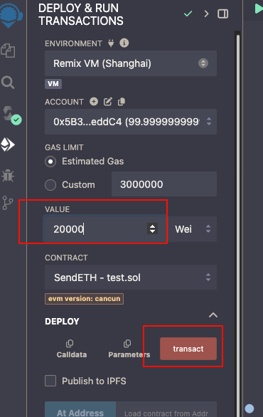
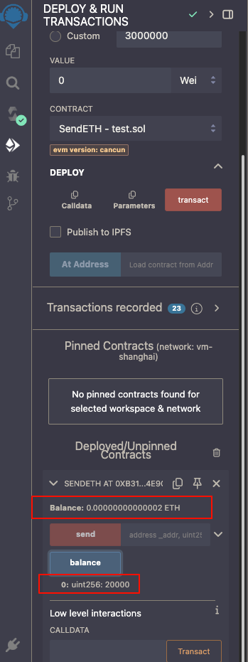

https://www.wtf.academy/docs/solidity-102/Fallback/
https://www.wtf.academy/docs/solidity-102/SendETH/

在部署SendETH和reviceFallback合约时没有后顺序

在部署SendETH时需要给合约本身充钱,要不然没钱去发送ETH




这样子就有钱去触发send发送ETH

``` javascript

contract SendETH {
    error Sendfaild();
    error CallFailed();

    uint256 public balance;
    // 部署的时候,给本身的合约充钱
    // constructor(address payable _to, uint256 amount) payable{
    //     _to.transfer(amount);
    // }
    constructor() payable{
        balance = msg.value;
    }

    // receive方法，接收eth时被触发
    receive() external payable{}

    function send(address _addr, uint256 amount) external payable {
      // 除了call还有哪些发送ETH方法呢?
       (bool success, ) =  _addr.call{ value: amount }("");
       if(!success) {
            revert CallFailed();
        }
    }
}

// 还有其他接受方法吗?
contract reviceFallback {
    uint256 public balance;

    event Received(address Sender,uint Value);
    event fallbackCalled(address Sender,uint Value,bytes Data);
    
    receive() external payable {
        emit Received(msg.sender,msg.value);
        balance = msg.value;
    }
    fallback() external payable  {
        emit fallbackCalled(msg.sender,msg.value, msg.data);
    }
}

```