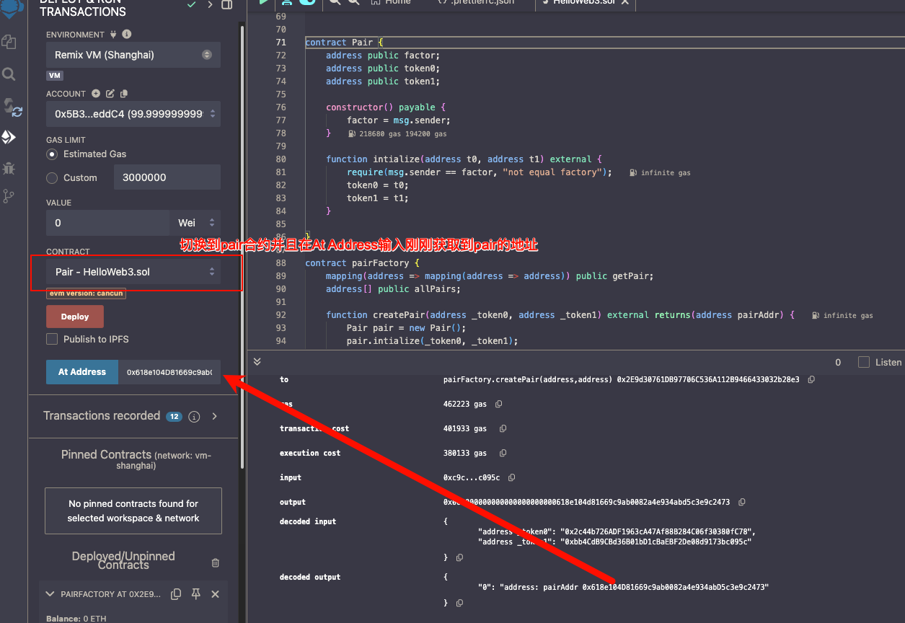

https://www.wtf.academy/docs/solidity-102/Create/

``` javascript
contract Pair {
    address public factor;
    address public token0;
    address public token1;

    constructor() payable {
        factor = msg.sender;
    }

    function intialize(address t0, address t1) external {
        require(msg.sender == factor, "UniswapV2: FORBIDDEN");
        token0 = t0;
        token1 = t1;
    }
    
}

contract pairFactory {
    mapping(address => mapping(address => address)) public getPair;
    address[] public allPairs;

    function createPair(address _token0, address _token1) external returns(address pairAddr) {
        Pair pair = new Pair();
        pair.intialize(_token0, _token1);
        pairAddr = address(pair);
        allPairs.push(pairAddr);
        getPair[_token0][_token1] = pairAddr;
        getPair[_token1][_token0] = pairAddr;
    }
}
```


WBNB地址: 0x2c44b726ADF1963cA47Af88B284C06f30380fC78
BSC链上的PEOPLE地址: 0xbb4CdB9CBd36B01bD1cBaEBF2De08d9173bc095c


在Remix部署pairFactory合约, 
使用WBNB和PEOPLE的地址作为参数调用createPair


调用之后获取到 Pair 合约地址, 再去部署Pair合约看看地址是不是设置成功了




这时候pair查到的token地址已经设置成功了


Q: 为什么一定要在At Address填写pairFactory生成的地址?

A: 如果你有合约地址, 就可以直接在At Address填写合约地址, 然后去调用对应的方法, 现在pairFactory已经生成了pair的合约地址,不需要重新部署新的pair合约,否则无法读取到pairFactory生成pair合约时一些逻辑的调用和参数.

注意! 在部署的时候, At Address 没有填写代表是新的合约
并不属于 pairFactory 里创建的合约